# wolfecoin Blockchain

In this activity I demonstrate how to set up a testnet blockchain and send a transaction between accounts.

---

### <b>Requirements:</b> 

* Blockchain-Tools including <b>geth</b> and <b>puppeth</b> must be installed. In this exercise I have created a copy called <b>Blockchain-Tools-wolfecoin</b> for illustrative purposes.

### <b>Step 1:</b> Create accounts for two (or more) nodes for the network with a separate datadir for each using geth

1. Open a terminal window and navigate to Blockchain-Tools-wolfecoin
2. Run the following command: `./geth account new --datadir node1`
3. Enter the password `wolfecoin`
4. Confirm the password `wolfecoin`
5. Take note of the Public address of the key and the Path of the secret key file that are generated for node1
6. Run the following command: `./geth account new --datadir node2`
7. Enter the password `wolfecoin`
8. Confirm the password `wolfecoin`
9. Take note of the Public address of the key and the Path of the secret key file that are generated for node2
#### Screenshot of geth configuration:
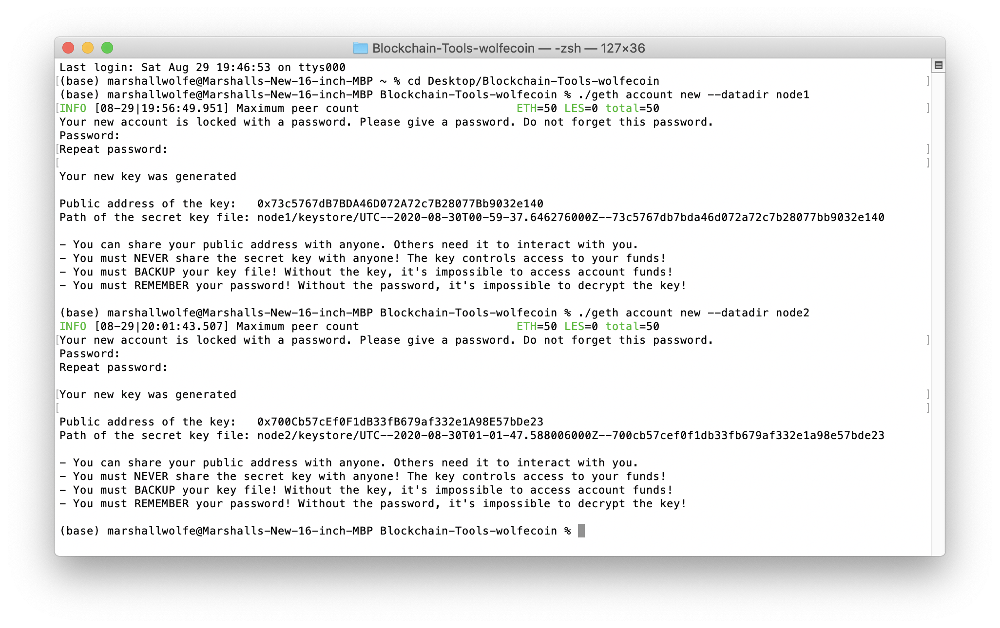

### <b>Step 2:</b> Use puppeth to generate a genesis block

1. Open a terminal window and navigate to Blockchain-Tools-wolfecoin
2. Run the following command: `./puppeth`
3. Type `2` to pick the Configure new genesis
4. Type `1` to Create new genesis from scratch
5. Type `2` to choose the Clique (Proof of Authority) consensus algorithm
6. Press `Enter` to choose the default =15 seconds blocks should take
7. Paste both account addresses for node1 and node2 one at a time into the list of accounts to seal. Press `Enter` to move to the next step
8. Paste them again in the list of accounts to pre-fund since there are no block rewards in Proof of Authority. Press `Enter` to move to the next step
9. Choose `no` for pre-funding the pre-compiled accounts (0x1 .. 0xff) with wei to keep the genesis cleaner
10. Choose the default = random chain/network ID by pressing `Enter`
11. Type `2` to choose Manage existing genesis
12. Type `2` to Export genesis configurations
13. Press `Enter` to export to the default = current folder
14. You can delete the wolfecoin-harmony.json file because we only need the wolfecoin.json file
#### Screenshot of puppeth configuration:
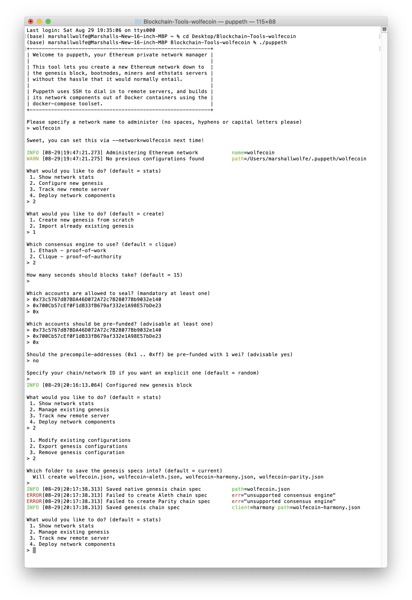

### <b>Step 3:</b> Initialize each node with the new wolfecoin.json with geth

1. Open a terminal window and navigate to Blockchain-Tools-wolfecoin
2. At this point, I determined that I needed to re-create node1 and node2 so I went back to repeat Step 1, and then proceeded to...
3. Run the following command: `./geth init wolfecoin.json --datadir node1`
4. Run the following command to initialize node1: `./geth init wolfecoin.json --datadir node2`
5. Run the following command to initialize node2: `./geth --datadir node1 --mine --minerthreads 1`
6. Run the following command to unlock the account and enable mining on the first node: `./geth --datadir node1 --mine --minerthreads 1`
7. Copy the enode that is generated
8. Open another terminal window and navigate to Blockchain-Tools-wolfecoin
9am . Run the following command to unlock the account and enable mining on the second node: `./geth --datadir node2 --port 30304 --rpc --bootnodes "enode://c830da9b6dba1c24033837114f1765207fa200e8f0922ce02fd4fa211d75da01221d4558ab7eee05b545af6844723ef92ec8f785fec8ef881a6f35d4057c8c23@127.0.0.1:30303"`
10. You should now see that both nodes are producing new blocks!
#### Screenshot of node1:
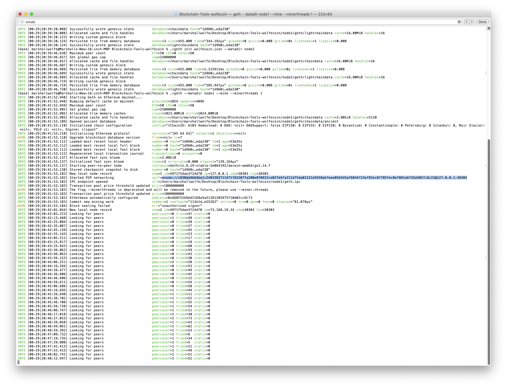

#### Screenshot of node2:
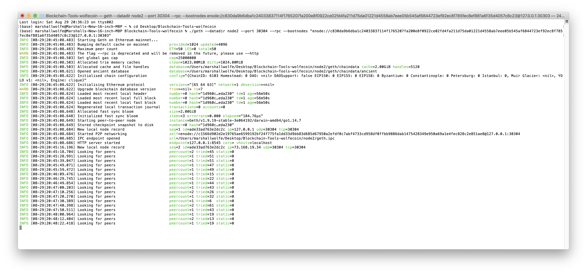

### <b>Step 4:</b> Send a test transaction

1. Use the MyCrypto GUI wallet to connect to the node1 by importing the keystore file from the node1/keystore directory directly into MyCrypto which will import the private key
2. Enter the password `wolfecoin`
#### Screenshot of node1/keystore:
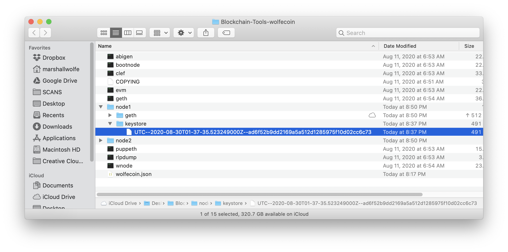
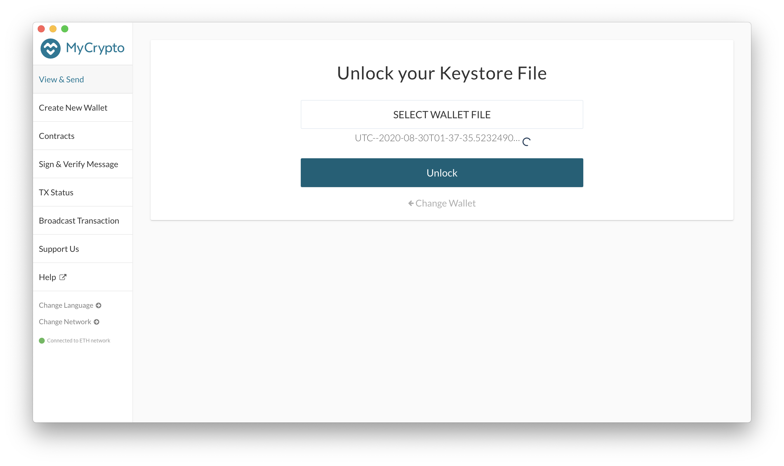
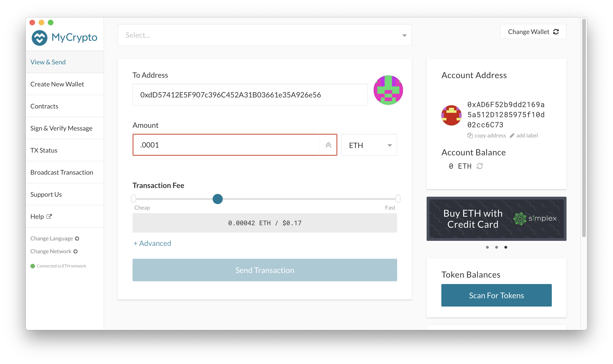
3. After noticing that the Account Balance was 0 ETH, I used https://faucet.kovan.network/ to fund the account with ETH
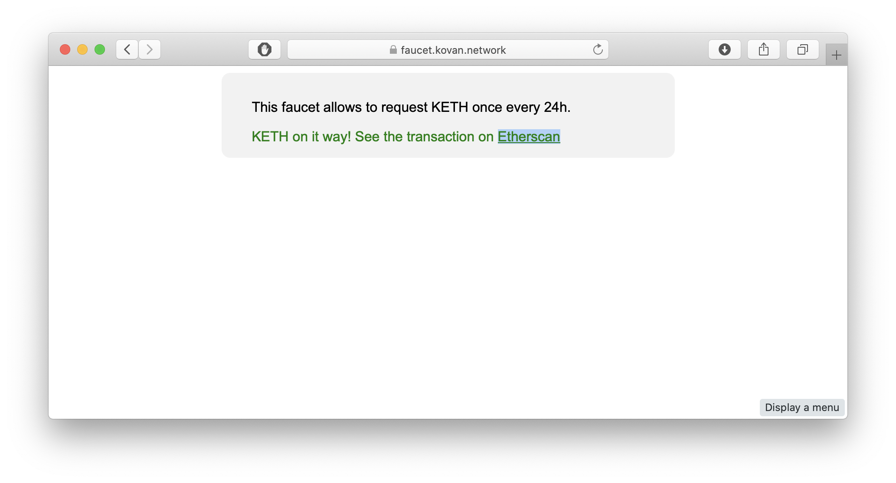
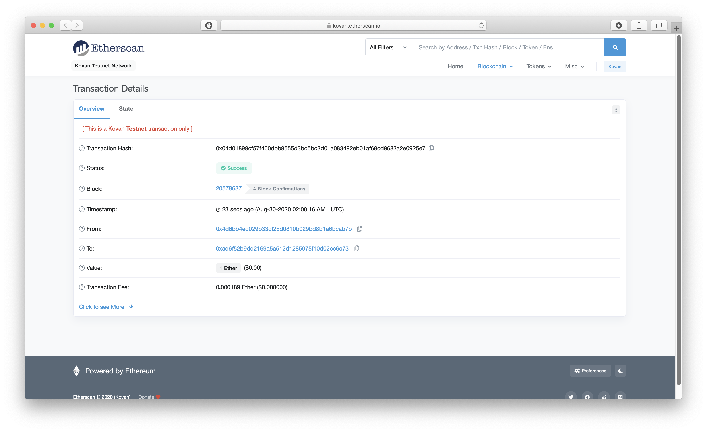
4. Changing to the Kovan network, I could now see 1 ETH in the Account Balance:
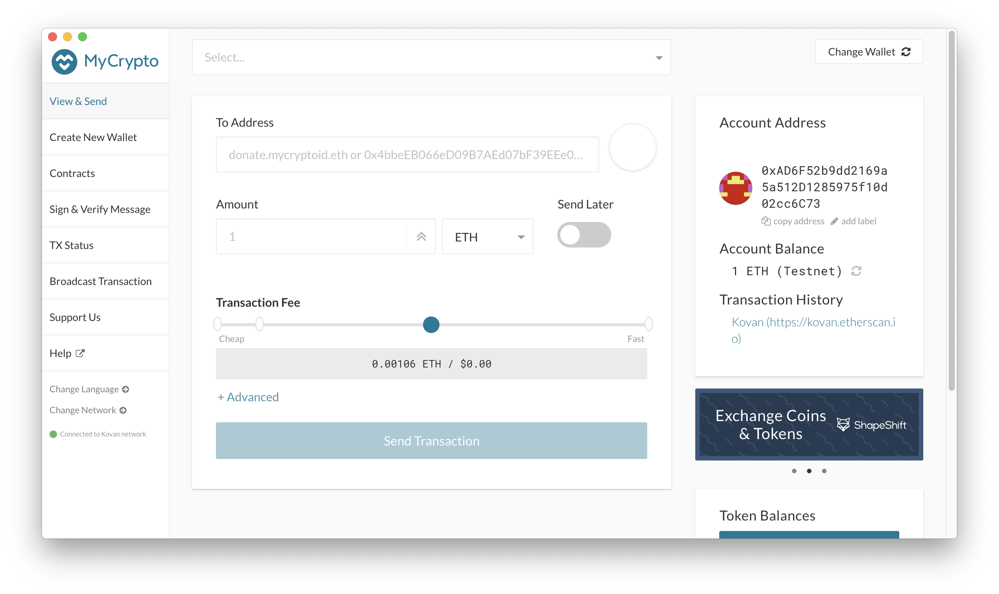
5. Send a transaction from the node1 account to the node2 account by pasting the Public address of the key for node2 into the To Address field, entering an amount of `.05`, and increasing the Transaction Fee to `0.00084 ETH` for a speedy transaction
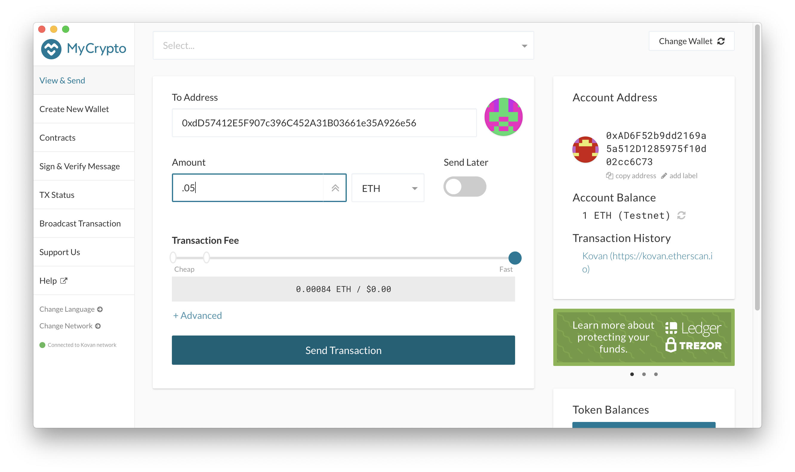
6. Choose `Send Transaction` and confirm by choosing `Send`
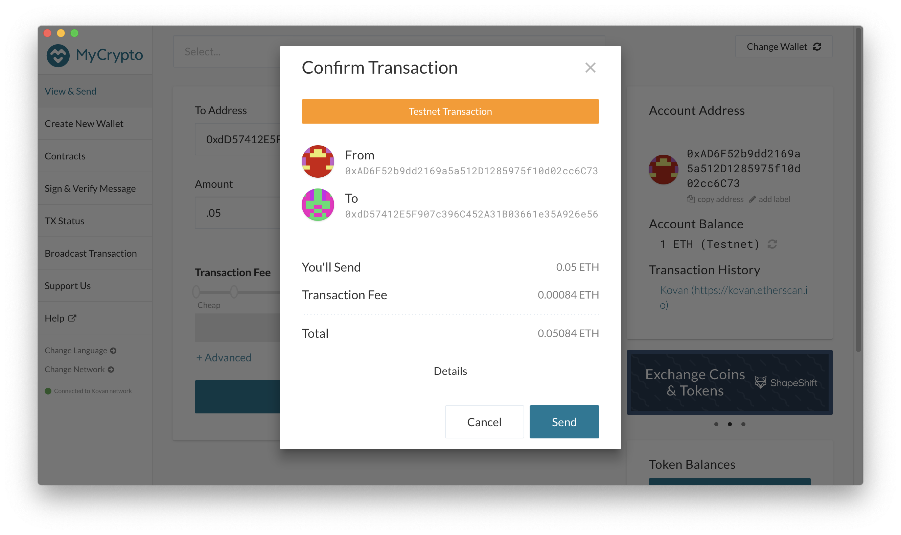
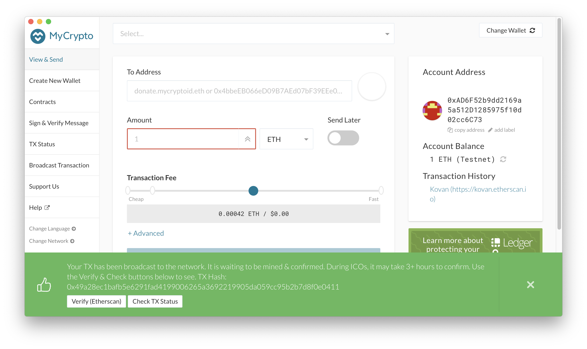
7. Copy the transaction hash and paste it into the "TX Status" section of the app, or click "TX Status" in the popup
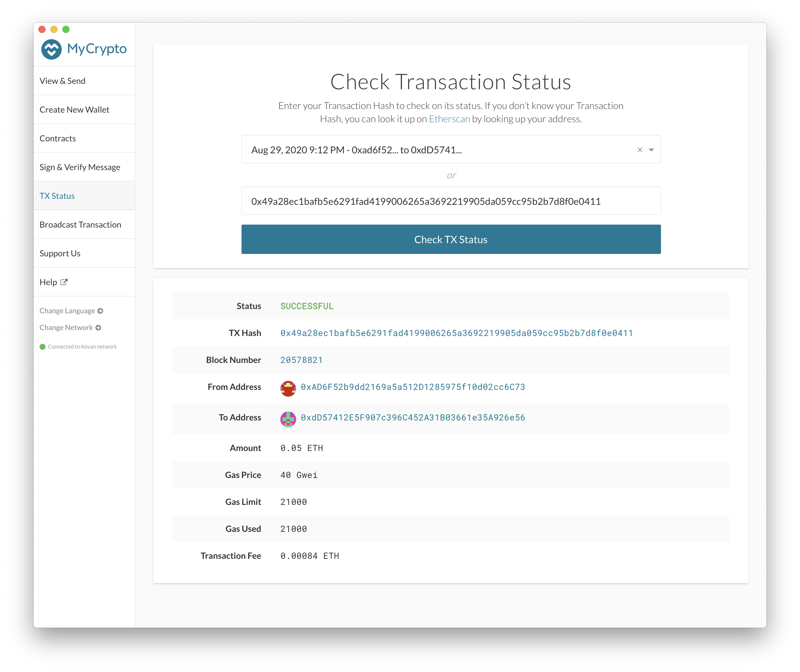

### <b>The transaction was successful!</b> 